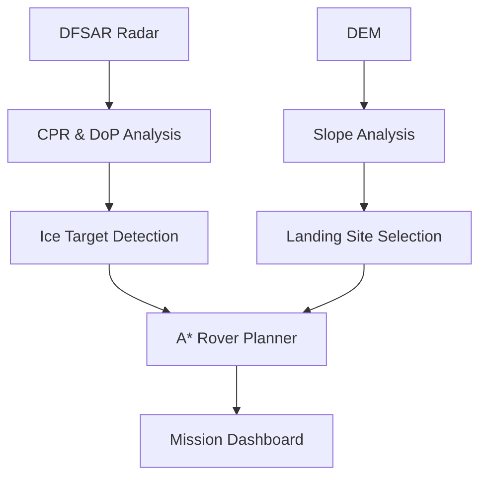

# CHANDRA-SETU

<p align="center">
  <strong>An intelligent lunar mission planning framework for subsurface ice detection, landing site selection, and rover traverse planning using Chandrayaan-2 DFSAR radar and DEM data.</strong>
</p>

<p align="center">
  <a href="https://huggingface.co/spaces/iaaryan/Buzzy-Bugs-BAH-2026-Chandra-Setu">🚀 Live Demo</a> •
  <a href="./notebooks/chandra_setu.ipynb">📓 Notebook</a> •
  <a href="./docs/BuzzyBugs_BAH-26_Chandrasetu.pdf">📄 Presentation</a>
</p>

> **Status:** Experimental research project developed for **BAH '26 – Challenge #8**. This repository is intended for research, learning, and demonstration purposes.

---

# What is CHANDRA-SETU?

CHANDRA-SETU is a notebook-first computational workflow that combines Chandrayaan-2 DFSAR radar products with DEM-derived terrain information to support lunar mission planning.

The workflow identifies potential subsurface ice targets, evaluates candidate landing sites, estimates terrain illumination using a DEM-derived proxy, and computes an efficient rover traverse route.

```text
DFSAR Radar + DEM
        │
        ▼
 Radar Analysis
        │
        ▼
 Ice Target Detection
        │
        ▼
 Landing Site Selection
        │
        ▼
 Illumination Proxy
        │
        ▼
 Rover Traverse Planning
        │
        ▼
 Interactive Dashboard
```

# Features

- Subsurface ice target detection
- DEM-based terrain analysis
- Landing site evaluation
- A* rover traverse planning
- Solar illumination proxy analysis
- Interactive Gradio dashboard
- Hugging Face deployment
- Google Colab implementation

# Screenshots

## Dashboard

<p align="center">

</p>

## Ice Detection

<p align="center">

</p>

## Landing Site Selection

<p align="center">

</p>

## Rover Traverse Planning

<p align="center">

</p>

> **Note:** If your dashboard screenshot currently has the filename `Screenshot (1781).png`, rename it to `dashboard.png` or update the image path above accordingly.

# Mission Workflow



# Technology Stack

| Component | Technology |
|-----------|------------|
| Programming Language | Python |
| Development | Google Colab |
| Dashboard | Gradio |
| Deployment | Hugging Face Spaces |
| Terrain Analysis | DEM |
| Radar Data | Chandrayaan-2 DFSAR |
| Path Planning | A* Algorithm |
| Visualization | Matplotlib |

# Repository Structure

```text
chandra-setu/
├── assets/
│   └── screenshots/
├── docs/
├── notebooks/
│   └── chandra_setu.ipynb
├── outputs/
├── src/
├── README.md
└── LICENSE
```

# Dataset

The notebook uses Chandrayaan-2 related radar and terrain datasets accessed from Google Drive during execution in Google Colab.

# Running the Notebook

1. Open `notebooks/chandra_setu.ipynb` in Google Colab.
2. Mount Google Drive.
3. Update dataset paths if required.
4. Run all notebook cells.

# Live Demo

https://huggingface.co/spaces/iaaryan/Buzzy-Bugs-BAH-2026-Chandra-Setu

# Current Limitations

- Notebook-first implementation
- Depends on Google Drive mounted datasets
- Threshold-based analysis
- DEM illumination proxy
- Intended for research and educational use

# Future Scope

- Machine learning based ice classification
- Improved terrain risk estimation
- Multi-objective rover planning
- Real solar illumination modelling
- Multi-rover coordination

# Author

Built by **Aaryan**.

---

Contributions, suggestions and constructive feedback are welcome.
