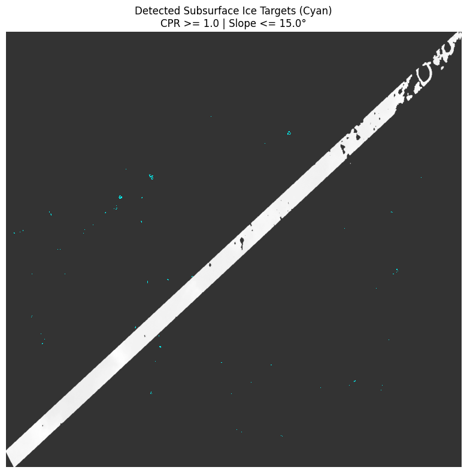
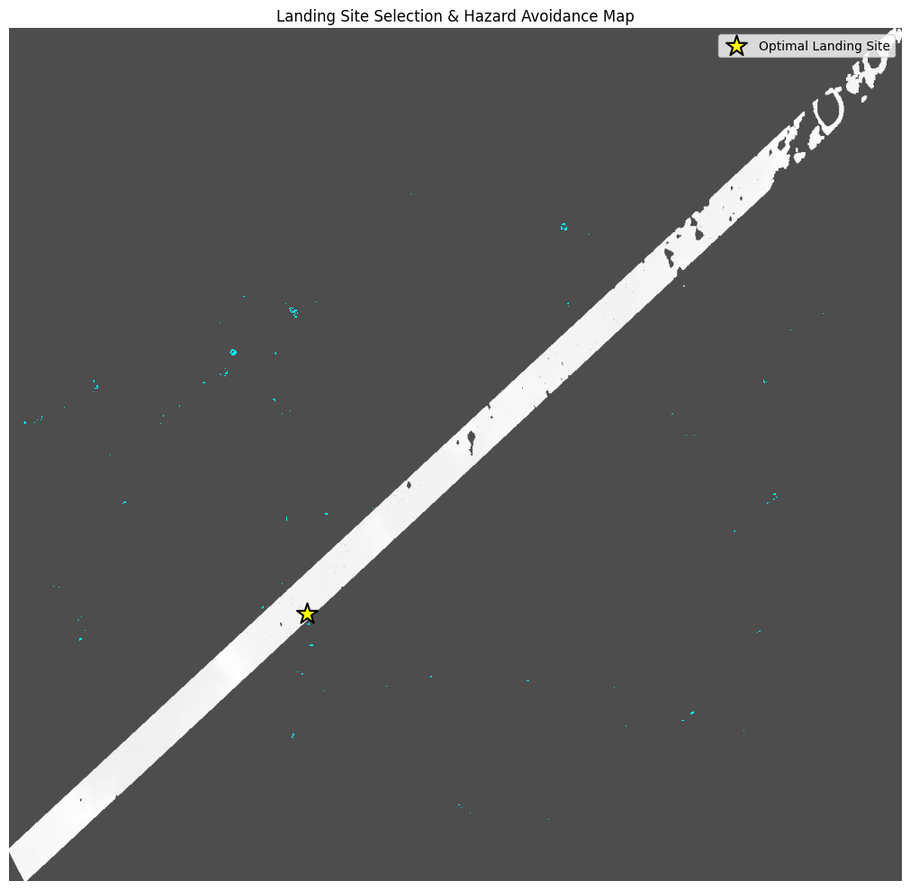
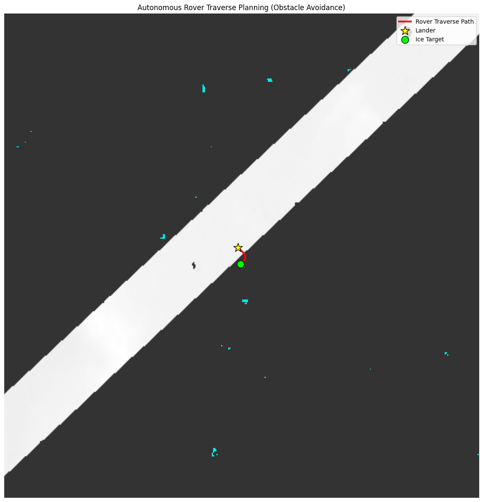
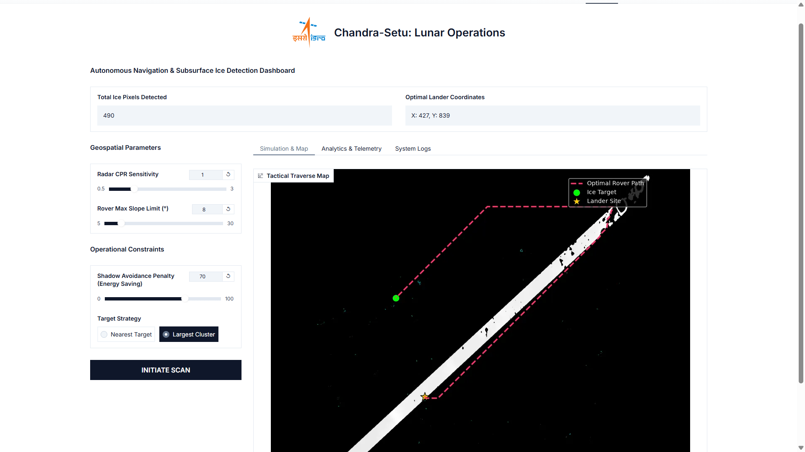

# CHANDRA-SETU

An intelligent lunar mission planning framework that detects potential subsurface ice, identifies safe landing sites, and plans rover traverse routes using Chandrayaan-2 DFSAR radar and DEM data.

> **Status:** Experimental research project developed for BAH '26 Challenge #8. This project is intended for research, learning, and demonstration purposes and is not intended for operational mission planning.

## What is CHANDRA-SETU?

CHANDRA-SETU is a computational mission planning framework that combines radar-derived ice detection, terrain analysis, landing site evaluation, and rover path planning into a single workflow.

The project processes Chandrayaan-2 DFSAR radar information together with Digital Elevation Model (DEM) data to identify potential subsurface ice targets, determine safe landing regions, and compute an efficient rover traverse path.

```text
DFSAR Radar
      +
 DEM Terrain
      ↓
 Ice Detection
      ↓
 Landing Site Selection
      ↓
 Solar Illumination Analysis
      ↓
 Rover Traverse Planning
      ↓
 Mission Control Dashboard
```

## Features

- Radar-based subsurface ice target detection
- DEM-based terrain analysis
- Landing site evaluation
- Hazard-aware rover traverse planning
- Solar illumination proxy analysis
- Interactive Gradio dashboard
- Hugging Face deployment
- Google Colab notebook implementation
- Visualization of mission outputs

## Mission Planning Pipeline

```text
DFSAR Radar
      +
Digital Elevation Model
      ↓
Radar Processing
      ↓
CPR & DoP Analysis
      ↓
Terrain Slope Analysis
      ↓
Potential Ice Targets
      ↓
Landing Site Selection
      ↓
Solar Illumination Analysis
      ↓
A* Rover Path Planning
      ↓
Mission Dashboard
```

## Ice Detection

The notebook applies radar-derived CPR (Circular Polarization Ratio), DoP, and terrain slope constraints to identify candidate subsurface ice locations.

Current decision rules include:

- CPR ≥ 1.0
- DoP < 0.13
- Terrain slope ≤ 15°

These thresholds are applied together to reduce false positives caused by rough terrain.

<p align="center">

</p>

## Landing Site Selection

Landing candidates are evaluated using:

- Terrain slope
- Hazard constraints
- Proximity to detected ice targets

Only locations satisfying the terrain constraints are considered suitable landing regions.

<p align="center">

</p>


## Solar Illumination Analysis

Because real-time solar ephemeris information is not available within the notebook workflow, terrain aspect derived from the DEM is used as an illumination proxy.

Shadowed terrain receives additional traversal cost during rover route planning.

## Rover Traverse Planning

The rover path is generated using the A* path planning algorithm.

Traversal cost incorporates terrain conditions together with the illumination penalty so that hazardous or poorly illuminated regions become less favorable.

```text
Landing Site
      ↓
Terrain Cost Map
      ↓
A* Search
      ↓
Optimal Traverse
      ↓
Ice Target
```

<p align="center">

</p>

## Mission Control Dashboard

The project includes an interactive dashboard built with **Gradio** and deployed on Hugging Face.

The dashboard allows visualization of:

- Ice targets
- Landing site selection
- Rover traverse path
- Mission parameters
- Mission outputs

<p align="center">

</p>

### Live Demo

https://huggingface.co/spaces/iaaryan/Buzzy-Bugs-BAH-2026-Chandra-Setu

## Project Structure

```text
chandra-setu/
│
├── assets/
│   └── screenshots/
├── data/
├── docs/
├── notebooks/
│   └── chandra_setu.ipynb
├── outputs/
├── src/
├── README.md
└── LICENSE
```

## Technology Stack

| Component | Technology | Purpose |
| :--- | :--- | :--- |
| Language | Python | Core implementation |
| Notebook | Google Colab | Development environment |
| Radar Processing | DFSAR | Ice detection inputs |
| Terrain | DEM | Terrain analysis |
| Navigation | A* Algorithm | Rover path planning |
| Visualization | Matplotlib | Output rendering |
| Dashboard | Gradio | Interactive interface |
| Deployment | Hugging Face Spaces | Live demonstration |

## Technical Architecture

```text
DFSAR Radar
        +
DEM Terrain
        ↓
Preprocessing
        ↓
CPR / DoP Analysis
        ↓
Slope Filtering
        ↓
Ice Detection
        ↓
Landing Site Selection
        ↓
Solar Analysis
        ↓
A* Path Planning
        ↓
Mission Dashboard
```

## Dataset

The notebook is designed to use Chandrayaan-2 related radar and terrain datasets mounted through Google Drive inside Google Colab.

The current implementation intentionally preserves the original Google Drive workflow used during development.

## Notebook

The complete implementation is available in:

```text
notebooks/chandra_setu.ipynb
```

## Screenshots

Project screenshots are available in:

```text
assets/screenshots/
```

## Current Limitations

Current limitations include:

- Implemented as a research notebook
- Depends on Google Colab and Google Drive data paths
- Uses predefined threshold-based decision rules
- Uses DEM-derived illumination proxy
- Intended for experimentation rather than operational deployment

## Good Use Cases

This project is suitable for:

- Lunar mission planning demonstrations
- Remote sensing education
- Research prototypes
- Space technology hackathons
- Terrain analysis experiments
- Academic projects

## Future Scope

Future versions may include:

- Machine learning based ice classification
- Adaptive threshold estimation
- Multi-objective rover planning
- Real solar ephemeris integration
- Multi-rover mission planning
- Confidence estimation and uncertainty analysis

## Author

Built by **Aaryan**.

---

If you find a bug or would like to improve the project, contributions and constructive feedback are welcome.
